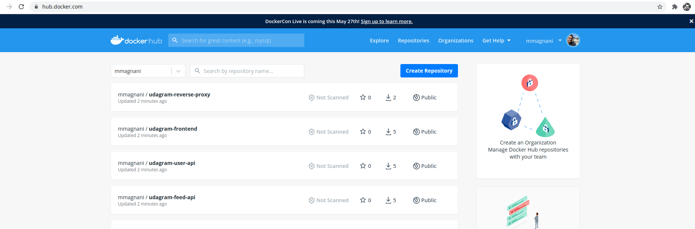
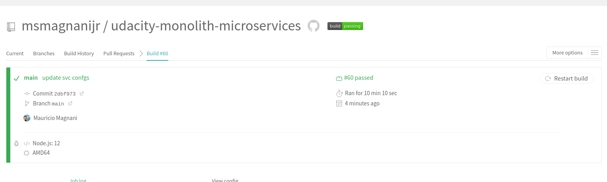
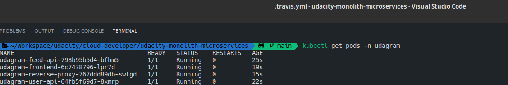
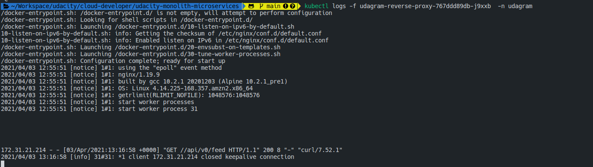

## Udacity Udagram - Refactor Monolith to Microservices: Image Filtering Application

Udagram is a simple cloud application developed alongside the Udacity Cloud Engineering Nanodegree. It allows users to register and log into a web client, post photos to the feed, and process photos using an image filtering microservice.

The project is split into two parts:
1. Frontend - Angular web application built with Ionic Framework
2. Backend RESTful API - Node-Express application

## Key Achievements: 

1. Refactor the API: Decompose the API code to have two separate projects that can be run independent of one another: /users and /feed endpoints.

2. Containerize the Code: Create Dockerfiles for the reverse proxy, frontend and backend applications.

3. Build CICD Pipeline: Set up GitHub account to integrate with Travis CI and generate a build pipeline and deploy pipeline on Elastic Kubernetes Service (Amazon EKS).

4. Deploy to Kubernetes: Deploy the Docker containers for the API applications and web application as their own pods in AWS EKS.

5. Set up Kubernetes Services: Configure a reverse proxy to direct requests to the appropriate backend and frontend loadbalancer

For more information about the Kubernetes Cluster check the file: udagram-screenshots/udagram-outputs.txt